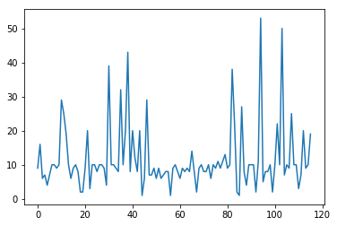
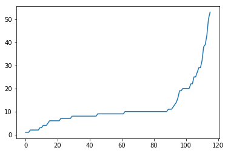
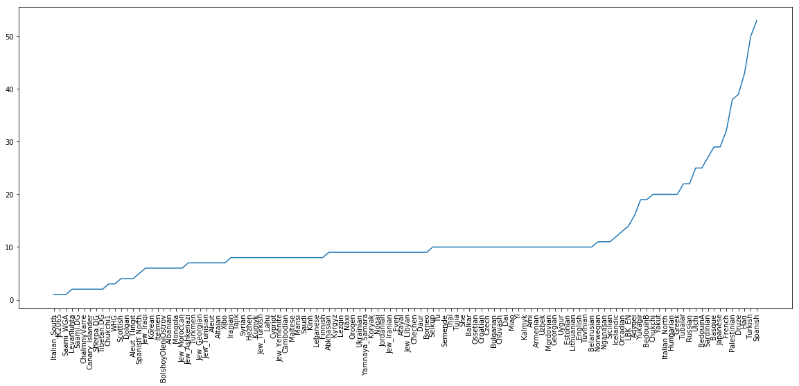

Setting up
==========

The Computational Infrastructure for this Workshop
--------------------------------------------------

For the practical sessions and exercises of this workshop, we have set up a Cloud Server with 32 CPUs and 64Gb of Memory in total with a separate user account for each participant. As participant, you will have received your own username and password for accessing the server. The simplest way to access the server is via Jupyter:

`https://c107-224.cloud.gwdg.de/hub/login`_

.. _https://c107-224.cloud.gwdg.de/hub/login: https://c107-224.cloud.gwdg.de/hub/login

where you can enter your username and password and are then logged into Jupyter. For reference, you find documentation for the Jupyter interface `here <https://jupyter.org/documentation>`__

More expert users can also access the server via custom terminal client software (such as ``Terminal`` on Mac OS X, or ``putty`` on Windows), via::

    ssh <USERNAME>@c107-224.cloud.gwdg.de

Basic Usage
-----------
When you first access Jupyter, you will get a file browser view of your home directory on the server. In the beginning, your home directory will be empty, and will be populated with notebooks and files throughout this workshop.

To create a new text file, click on *New* (in the upper right corner) and then *Text File*, which opens a text editor within your browser. You can now add content into the file, or edit existing content and save. The filename can be changed by clicking into the Filename on top. You can now go back to your file browser window and update using the button with the two arrows in the upper right corner, and you should see your text file saved in your home directory.

You can also use Jupyter to open a Terminal within the browser: Click on *New* and then *Terminal*, which will open a terminal window in a separate browser tab. You can enter Unix Bash commands to change directories, view files or execute programs (as we will learn below). 

Finally, you can create new Folders by clicking on *New* and then *Folder*. To rename the new folder, click on the checkbox beside the new folder, and click the *Rename* button on top, which appeared. To change into the new folder, click on it. To move back, click on the parent folder appearing on top of the file browser.

.. admonition:: Exercise

  Create a new folder called ``hello``, and a text file within that folder using Jupyter. Name that text file ``hello.txt`` and fill it with arbitrary content, such as "Hello, World!". Then open a terminal and output the contents of the new text file typing ``cat hello/hello.txt`` followed by ENTER.

.. note::
   
   While the Jupyter terminal and Jupyter Text Files are different ways to interact with the server, both access the same file system. So files created with the Text Editor are saved in your home directory, and can be accessed via the terminal, and vice versa: Files created via the Terminal can be accessed via the Text Editor, by simpling clicking on them in the Jupyter File Browser.

Notebooks
---------

Notebook can be loaded for different underlying kernels: bash, python and R. Notebooks are useful to document interactive data analysis. It combines code cells with markdown cells. A markdown cell can contain text, math or headings. 

.. admonition:: Exercise

  Create a new bash notebook. Then select in the dropdown list above "Markdown". Type ``# Bash Exercises`` into the cell, press Shift-Enter and watch. Then type ``This is text with *italic* and **bold** letters``. Then again type Shift-ENTER and watch.
  
.. hint::
   
   To change the cells, double click into them.

Code cells can be used to write arbitrary code, execute it and get the results printed back into the Notebook.

.. admonition:: Exercise

  A new empty Code cell should have been added to the Notebook in the last step. Click into this code cell and type ``ls``. This should output the current directories and files into the notebook. Into a new cell enter ``NAME="Hello World"`` and in the line below (same cell) ``echo $NAME``. Then again Shift-ENTER.
  
You can use Bash notebooks to perform standard Unix tasks and run programs throughout this workshop. That way, you have always documented what you did.

In Python 3 notebooks you can plot things: Create a new python3 notebook, and use this boilerplate code in the first cell::

  %matplotlib inline
  import matplotlib.pyplot as plt

Then plot something:

.. admonition:: Exercise

  Create a simple plot using ``plt.plot([1, 2, 3], [5, 2, 6])``

Working with Bash
-----------------

Bash denotes both a scripting language and the interactive system that is used with Terminals (and Bash notebooks). In the following, we will learn some basic use cases and commands.

Simple commands
^^^^^^^^^^^^^^^

The most important commands in a Unix shell are ``ls``, ``cd`` and ``mkdir``. In general, all commands in a Unix shell are entered by typing the command and then typing ENTER.

.. admonition:: Exercise
 
  Open a Terminal and execute the ``ls`` command by typing ``ls``. It should list you the contents of your home directory. Then run ``mkdir testdir`` to create a new directory. Then type ``cd testdir`` to change into that new directory.

Let's learn some more commands. Above you have already used ``cat`` to output the contents of a file to the screen. Another important command is ``echo``, which also prints stuff to the screen, but not from a file but from a string that you give it. For example:

.. admonition:: Exercise

  try the command ``echo "Hello, how are you?"`` in your terminal.

Another important command is ``grep``, which lets you filter out lines of a file that contain certain strings. As a basic example, consider this file listing genotyped individuals: ``/data/pca/genotypes_small.ind``. You can for example now list all French individuals via ``grep French /data/pca/genotypes_small.ind``.

.. admonition:: Exercise

  try the above listing of French individuals. Also try other population names, like "Polish" or "Lebanese". Instead of just ``grep``, try ``grep -c`` and see what that does (find out using ``man grep`` on a terminal.

.. hint:: In bash, you can use tab-expansion. Instead of heaving to spell out ``/data/pca/genotypes_small.ind``, you can try typing ``/da<TAB>pca/geno<TAB>``.

In general, in order to get help on any bash command, including the above, you can use ``man`` to review the documentation. For example, in a Terminal window, run ``man mkdir`` to view the documentation of the ``mkdir`` command. Use Space to move forward through the documentation, or the UP- and DOWN- keys. Use ``q`` to quit the view.

.. warning:: Use ``man <COMMAND>`` only in the Terminal, not in a bash-notebook!

Pipes
^^^^^

We will use Pipes in several places in this workshop. The basic idea is to combine multiple bash commands into powerful workflows. As an example, we'll use a simple bash pipeline to count the number of populations in our individual file. We need some new commands for that. First, let's look at the structure of the file at question. The command ``head /data/pca/genotypes_small.ind`` outputs::

                 Yuk_009 M    Yukagir
             Yuk_025 F    Yukagir
             Yuk_022 F    Yukagir
             Yuk_020 F    Yukagir
               MC_40 M    Chukchi
             Yuk_024 F    Yukagir
             Yuk_023 F    Yukagir
               MC_16 M    Chukchi
               MC_15 F    Chukchi
               MC_18 M    Chukchi

So this file contains three columns, with variable numbers of leading whitespace in each row. For counting the number of populations, we need to first cut out the third column of this file. A useful command for this is the command ``awk {print $3}``, which you will learn more about later. Let's now build our first pipe. We will pipe the output of ``head /data/pca/genotypes_small.ind`` into ``awk {print $3}``, by running::

    head /data/pca/genotypes_small.ind | awk '{print $3}'

This means "Take the output of the first command, and pipe it into the input of the second command. The result is::

    Yukagir
    Yukagir
    Yukagir
    Yukagir
    Chukchi
    Yukagir
    Yukagir
    Chukchi
    Chukchi
    Chukchi

OK, so now we have to sort these population names, and of course there is a command for that: ``sort``. 

.. admonition:: Exercise

    Build a pipeline that extracts the third column of the "ind" file and sorts it. Don't use ``head`` in the beginning, but pipe the entire file through the awk script. You already know which command outputs an entire file!

.. hint:: Use ``head`` frequently to test pipelines, by putting it at the end of a pipeline and only look at the first 10 rows of your pipeline output. 

OK, so finally, we need to remove duplicates from the sorted population names, and the appropriate command for that is the ``uniq`` command (which works only on sorted input). 

.. admonition:: Exercise

    Extend the pipeline from above to output unique population labels.
    
    
The first ten rows of that pipeline output (verfiable with ``head``) should read::

    Abkhasian
    Adygei
    Albanian
    Aleut
    Aleut_Tlingit
    Altaian
    Ami
    Armenian
    Atayal
    Balkar

The final step is to count the lines. The command for that is ``wc -l``, which counts the lines from its input.

.. admonition:: Exercise

     Extend the pipeline one last time, by piping the output into ``wc -l``.

We can now do one final step and augment the pipeline we have built to output not only the total number of populations, but also the number of individuals per population. The trick here is to use the ``uniq -c`` command, instead of just ``uniq``. That will output the unique population labels alongside the number of times it is seen. The final pipeline then reads::

    cat /data/pca/genotypes_small.ind | awk '{print $3}' | sort | uniq -c

You can run this and store the result in a file, using standard redirection. This is achieved via the operator ``> FILENAME``. So for example, you can extend the above pipeline with ``> population_frequencies.txt`` to output the result in a file called ``population_frequencies.txt``.

Back to Notebooks
-----------------

.. admonition:: Exercise

     You should now try to implement the step-by-step build up of that pipeline in a bash notebook. You can find my own example `here <https://nbviewer.jupyter.org/github/stschiff/compPopGenWorkshop2019_docs/blob/master/solution_notebooks/setting_up_bash.ipynb>`__.
     

Some Plotting with Python
-------------------------

As a final exercise, we now want to plot the population frequencies. As a first step, we again open a python notebook and include the already known boilerplate in a code cell::

    %matplotlib inline
    import matplotlib.pyplot as plt

In addition, we need to load the pandas_ library::

  import pandas as pd

.. _pandas: https://pandas.pydata.org
 
We can now load the ``population_frequencies.txt`` (or however you have called it) into python, using pandas ``read_csv`` function. 

.. admonition:: Exercise

    Look up some documentation for the ``read_csv()`` function, by typing in a python notebook ``?pd.read_csv``. This should open a little extra window with help information. For reading the population frequencies, you will need options ``delim_whitespace`` and ``names``. Look them up.

You can now load in the data, using the command::

    dat = pd.read_csv(FILENAME, delim_whitespace=True, names=["nr", "pop"])

.. admonition:: Exercise

    Execute the above command using the correct filename (make sure you specify the correct path and directory to it, if the file is not in the same directory as your notebook).

.. note:: The column names, here "nr" and "pop" are arbitrary and just denote the names for the two columns in the file.

You can verify that loading this data has succeeded by just typing ``dat`` into a new code cell and checking that it outputs a nicely formatted dataframe with two columns and an index.

We can now go ahead and plot this. As a first step, we can just try the simplest way of plotting::

   plt.plot(dat["nr])

which should yield something like this:

Now this already shows that the majority of populations has something like 10 individuals, but we would like to also display the population labels, and sort the values. As first step, we first create a sorted version of this dataframe using the following command::

    dat_sorted = dat.sort_values(by="nr")

.. admonition:: Exercise
   
   Look up the ``sort_values`` method with ``?dat.sort_values`` and see what it does and what the ``by=`` option does.

We can now make a sorted plot. For that we actually need two arguments to ``plt.plot``, one for specifying the x coordinate of each point, and one for the y coordinate for each point (before we didn't need that because ``plt.plot`` assumes a default x value if none is given, which is the index in the dataframe. Now this got resorted, so we have to spcify it). Here is the command::

   x = range(len(dat_sorted))
   y = dat_sorted["nr"]
   plt.plot(x, y)

Here, the ``range(len(dat_sorted))`` just produces an array which looks like ``[0, 1, 2, 3, 4, ...``, so it simply creates a list from 1 to the number of populations minus one. This command produces a sorted version of the previous plot:

OK, so now the final step is to add the labels. We of course have the labels already in our dataframe, under the "pop" column. The function that adds labels is the ``plt.xticks`` function.

.. admonition:: Exercise

    Look up the documentation for the ``plt.xticks`` function, similarly as in the previous exercise.

For the final plot, we now put this together, and we also increase the figure size a bit to accommodate all the population labels. Together we have::

    dat_sorted = dat.sort_values(by="nr")
    y = dat_sorted["nr"]
    x = range(len(y))
    xticks = dat_sorted["pop"]
    plt.figure(figsize=(20,8))
    plt.plot(x, y)
    plt.xticks(x, xticks, rotation="vertical");

which gives this final plot:

You can find a solution notebook for this part `here <https://nbviewer.jupyter.org/github/stschiff/compPopGenWorkshop2019_docs/blob/master/solution_notebooks/plotting_popfreqs.ipynb>`__.
