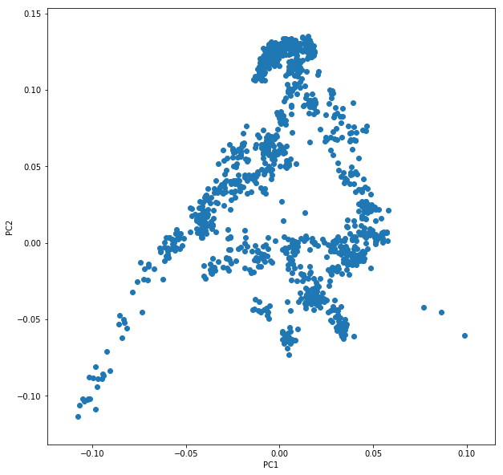
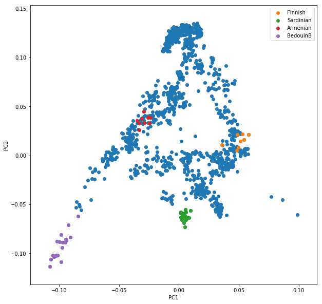
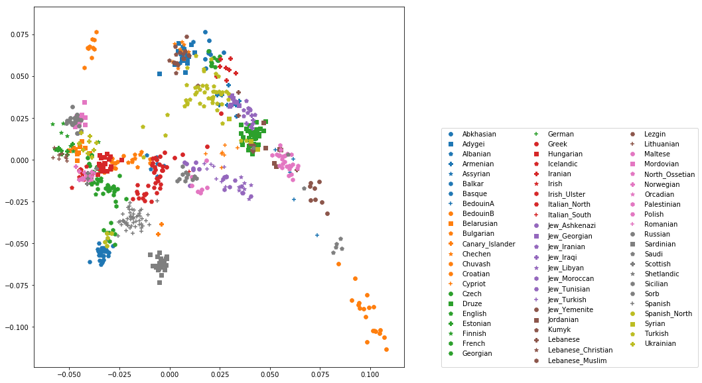
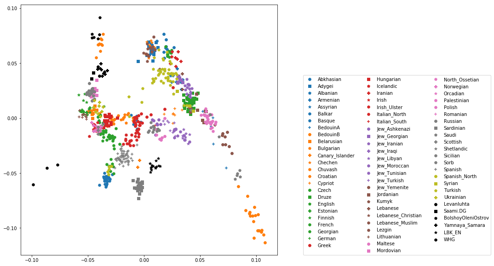

.. _PCA_section:

Principal Components Analysis (PCA)
===================================

Principal components analysis (PCA) is one of the most useful techniques to visualise genetic diversity in a dataset. The methodology is not restricted to genetic data, but in general allows breaking down high-dimensional datasets to two or more dimensions for visualisation in a two-dimensional space.

Genotype Data
-------------

This lesson is also our first contact with the genotype data used in this and most of the following lessons. The dataset that we will work with contains 1,340 individuals, each represented by 593,124 single nucleotide polymorphisms (SNPs). Those SNPs have exactly two different alleles, and each individual has one of four possible values at each genotype: homozygous reference, heterozygous, homozygous alternative, or missing. Those four values are encoded 2, 1, 0 and 9 respectively. 

The data is laid out as a matrix, with columns indicating individuals, and rows indicating SNPs. The data itself comes in the so-called "EIGENSTRAT" format, which is defined in the `Eigensoft package`_ used by many tools used in this workshop. In this format, a genotype dataset consists of three files, usually with the following file endings:

``*.snp``
  The file containing the SNP positions. It consists of six columns: SNP-name, chromosome, genetic positions, physical position, reference allele, alternative allele.
``*.ind``
  The file containing the names of the individuals. It consists of three columns: Individual Name, Sex (encoded as M(ale), F(emale), or U(nknown)), and population name.
``*.geno``
  The file containing the genotype matrix, with individuals laid out from left to right, and SNP positions laid out from top to bottom.
  
.. _Eigensoft package: https://github.com/DReichLab/EIG

.. admonition:: Exercise

  Explore the three files used in the workshop using the terminal. They are located unser ``/data/pca/genotypes_small.*``. Use the bash terminal, and use ``less -S <FILENAME>`` to view each file and skim through it to get a feeling for the data.

.. admonition:: Exercise

  Start a new bash notebook and look at the first 20 rows of both the ``ind`` and the ``snp`` file using ``head -20``. For the ``geno`` file, restrict to the first 100 columns using ``cut -c 1-100``, which you can also use in a pipe together with ``head -20``.

.. admonition:: Exercise

  Confirm that there are 1,340 individuals in the dataset. Confirm that this number equals the number of rows in the ``ind`` file, and the number of columns in the ``geno`` file..

.. hint:: You can use ``head -1`` to restrict to the first line of a file, and ``wc -c`` to count the number of characters (i.e. columns) in that file.

.. admonition:: Exercise

   Count how many individuals per population there are. Hint: You can use the Unix tools ``awk '{print $3}'``, ``sort`` and ``uniq -c`` to achieve that.

You can find my solution notebook to these exercises `here <https://nbviewer.jupyter.org/github/stschiff/compPopGenWorkshop2019_docs/blob/master/solution_notebooks/exploring_genotypes.ipynb>`_

How PCA works
-------------

To understand how PCA works, consider a single individual and its representation by its 593,124 markers. Formally, each individual is a point in a 593,124-dimensional space, where each dimension
can take only the three possible genotypes indicated above, or have missing data. To visualise this high-dimensional dataset, we would like to project it down to two dimensions. But as there are many ways to project the shadow of a three-dimensional object on a two dimensional plane, there are many (and even more) ways to project a 593,124-dimensional cloud of points to two dimensions. What PCA does is figuring out the "best" way to do this project in order to visualise the major components of variance in the data.

Preparing the parameter file
----------------------------

For actually running the analysis, we use a software called ``smartPCA`` from the `Eigensoft package`_. As many other tools from this and related packages, ``smartPCA`` reads in a parameter file which specifies its input and output files and options. The basic format of the parameter file with one extra option (lsqproject) looks like this::

  genotypename: <GENOTYPE_DATA>.geno
  snpname: <GENOTYPE_DATA>.snp
  indivname: <GENOTYPE_DATA>.ind
  evecoutname: <OUT_FILE>.evec
  evaloutname: <OUT_FILE>.eval
  poplistname: <POPULATION_LIST_FILE>.txt
  lsqproject: YES
  numoutevec: 4
  numthreads: 1

Here, the first three parameters specify the input genotype files, as discussed above. The next two rows specify two output file names, typically with ending ``*.evec`` and ``*.eval``. The parameter line beginning with ``poplistname`` contains a file with a list of populations used for calculating the principal components (see below). The option ``lsqproject`` is important for applications including ancient DNA with lots of missing data, which I will not elaborate on. For the purpose of this workshop, you should use ``lsqproject: YES``. The last option ``numoutevec`` specifies the number of principal components that we compute.

Population lists vs. Projection
-------------------------------

The parameter named ``poplistname`` is a very crucial one. It specifies the populations whose individuals are used to calculate the principal components. Why not just all of them you ask? For two reasons: First, there are simply too many of them. As you may have found out in the exercise above there are more than 500 ancient and modern populations available in the dataset, and we don't want to use all of them, since the computation would take too long. More importantly, however, we generally try to avoid using ancient samples to compute principal components, to avoid specific ancient-DNA related artefacts affecting the computation. 

So what happens to individuals that are not in populations listed in the population list? Well, fortunately, they are not just ignored, but "projected". This means that after the principal components have been computed, *all* individuals (not just the one in the list) are projected onto these principal components. That way, we can visualise ancient populations in the context of modern genetic variation. While that may sound a bit problematic at first (surely there must be variation in ancient populations that is not represented well by modern populations), but it turns out to be nevertheless one of the most useful tools for this purpose. The advantage of avoiding ancient-DNA artefacts and batch effects to affect the visualisation outweighs the disadvantage of missing some private genetic variation components in the ancient populations themselves. Of course, that argument breaks down once the analysed populations become too ancient and detached from modern genetic variation. But for our purposes it will work just fine.

For this workshop, I prepared two population lists::

  /data/pca/WestEurasia.poplist.txt
  /data/pca/AllEurasia.poplist.txt

As you can tell from the names of the files, they specify two sets of modern populations representing West Eurasia or all of Europe and Asia, respectively.

.. admonition:: Exercise

  Look through both of the population lists and google some population names that you don't recognise to get a feeling for the ethnic groups represented here.

Running smartPCA
----------------

Now go ahead and prepare a parameter file according to the layout described above.

.. hint:: Put all filenames with their absolute path into the parameter file. To prepare the parameter file, you can use the so-called "Heredoc" syntax in bash, if you are familiar with it (see also solution notebook below). Alternatively, you can use the Jupyter file editor to create the parameter file.

... and run smartPCA using the command ``smartpca -p PARAMS_FILE > smartpca.log``. Here, I'm using bash redirection of the log output of ``smartpca`` into a log file called ``smartpca.log``, which may be useful for trouble shooting.

.. admonition:: Exercise

  Run ``smartpca`` with the prepared parameter file.
  
.. note:: Running ``smartPCA`` with this dataset and on a single CPU takes between 30 and 60 minutes.

To facilitate further processing, I have put the results file into ``/data/pca/results/pca.WestEurasia.*`` and ``/data/pca/results/pca.AllEurasia.*``

Plotting modern populations
---------------------------

There are several ways to make nice publication-quality plots (Excel is usually not one of them). Popular tools include R_ and matplotlib_ . Both frameworks can be used within the Jupyter Notebook interface, and here I opted for matplotlib.

.. _R: https://www.r-project.org>
.. _matplotlib: http://matplotlib.org

I suggest that you start a new Jupyter Python Notebook, and load a couple of essential libraries in the first code cell::

  %matplotlib inline
  import pandas as pd
  import matplotlib.pyplot as plt

Let's have a look at the main results file from ``smartpca``, the ``*.evec`` file, for example by running this simple bash command in the notebook using ``!head EVEC_FILE``, where ``EVEC_FILE`` should obviously replaced with the actual filename of the PCA run.

.. hint:: You can run any bash command in a python notebook by preceding it with the ``!`` sign. This comes in very handy at times!

You should find something like::

           #eigvals:     6.289     3.095     2.693     2.010
                I001    -0.0192      0.0353     -0.0024     -0.0084     Ignore_Iran_Zoroastrian(PCA_outlier)
                I002    -0.0237      0.0372     -0.0018     -0.0133     Ignore_Iran_Zoroastrian(PCA_outlier)
           IREJ-T006    -0.0226      0.0417      0.0045      0.0003     Iran_Non-Zoroastrian_Fars
           IREJ-T009    -0.0214      0.0404      0.0024     -0.0064     Iran_Non-Zoroastrian_Fars
           IREJ-T022    -0.0165      0.0376     -0.0003     -0.0106     Iran_Non-Zoroastrian_Fars
           IREJ-T023    -0.0226      0.0376     -0.0031     -0.0101     Iran_Non-Zoroastrian_Fars
           IREJ-T026    -0.0203      0.0373     -0.0009     -0.0103     Iran_Non-Zoroastrian_Fars
           IREJ-T027    -0.0241      0.0392      0.0025     -0.0072     Iran_Non-Zoroastrian_Fars

The first row contains the eigenvalues for the first 4 principal components (PCs), and all further rows contain the PC coordinates for each individual. The first column contains the name of each individual, the last row the population. To load this dataset with python, we use the pandas_ package, which facilitates working with data in python. To load data using pandas_, use the ``read_csv()`` function.

.. _pandas: https://pandas.pydata.org

.. admonition:: Exercise

  Load one of the two PCA results files with ending ``*.evec``. You need to skip the first row and name the columns manually. Use "Name", "PC1", ... "PC4", "Population" for the column names. Google documentation for ``read_csv()`` to ensure that tabs and spaces are considered field delimiters, that the first row is skipped, and that the column names are correctly entered. 

You should now have a pandas dataframe which looks like this::

        Name    PC1    PC2     PC3     PC4     Population
                I001    -0.0192      0.0353     -0.0024     -0.0084	Ignore_Iran_Zoroastrian(PCA_outlier)
                I002    -0.0237      0.0372     -0.0018     -0.0133	Ignore_Iran_Zoroastrian(PCA_outlier)
           IREJ-T006    -0.0226      0.0417      0.0045      0.0003	Iran_Non-Zoroastrian_Fars
           IREJ-T009    -0.0214      0.0404      0.0024     -0.0064	Iran_Non-Zoroastrian_Fars
           IREJ-T022    -0.0165      0.0376     -0.0003     -0.0106	Iran_Non-Zoroastrian_Fars
           IREJ-T023    -0.0226      0.0376     -0.0031     -0.0101	Iran_Non-Zoroastrian_Fars
           IREJ-T026    -0.0203      0.0373     -0.0009     -0.0103	Iran_Non-Zoroastrian_Fars
           IREJ-T027    -0.0241      0.0392      0.0025     -0.0072	Iran_Non-Zoroastrian_Fars

Let's say you called this dataframe ``pcaDat``. You can now very easily produce a plot of PC1 vs. PC2 for all samples , by running ``plt.scatter(x=pcaDat["PC1"], y=pcaDat["PC2"])``, which in my case yields a boring figure like this:

Now, obviously, we would like to highlight the different populations by color. A quick and dirty solution is to simply plot a different subset of the data on top, like this::

    plt.scatter(x=pcaDat["PC1"], y=pcaDat["PC2"], label="")
    for pop in ["Finnish", "Sardinian", "Armenian", "BedouinB"]:
        d = pcaDat[pcaDat["Population"] == pop]
        plt.scatter(x=d["PC1"], y=d["PC2"], label=pop)
    plt.legend()

This sequence of commands gives us:

OK, but how do we systematically show all the populations? There are too many of those to separate them all by different colors, or by different symbols, so we need to combine colours and symbols and use all the combinations of them to show all the populations. To do that, we first need to load the population list that we want to focus on for now, which are the same lists as used above for running the PCA. In case of the West Eurasian PCA, you can load the file using ``pd.read_csv("/data/pca/WestEurasia.poplist.txt", names=["Population"]).sort_values(by="Population")``. Next, we need to associate a color number and a symbol number with each population. To keep things simple, I would recommend to simply cycle through all combinations automatically. This code snippet looks a bit magic, but it does the job::

  nPops = len(popListDat)
  nCols = 8
  nSymbols = int(nPops / nCols)
  colorIndices = [int(i / nSymbols) for i in range(nPops)]
  symbolIndices = [i % nSymbols for i in range(nPops)]
  popListDat = popListDat.assign(colorIndex=colorIndices, symbolIndex=symbolIndices)

You should check that this worked by viewing the resulting ``popListDat`` variable (just type its name into a new Jupyter notebook cell). Now we can produce the full PCA plot, which uses a for loop to cycle through all populations in the ``popListDat`` dataframe, and plots each listed population in turn, with its assigned color and symbol. To prepare, we need a list of colors and symbols. Here, I am using the default color sequence from ``matplotlib`` and a manual sequence of symbols, which for the sake of simplicity I simply put here for you to copy-paste::

  symbolVec = ["8", "s", "p", "P", "*", "h", "H", "+", "x", "X", "D", "d", "<", ">", "^", "v"]
  colorVec = [u'#1f77b4', u'#ff7f0e', u'#2ca02c', u'#d62728', u'#9467bd',
              u'#8c564b', u'#e377c2', u'#7f7f7f', u'#bcbd22', u'#17becf']

With this, the final plot command is::

  for i, row in popListDat.iterrows():
      d = pcaDat[pcaDat.Population == row["Population"]]
      plt.scatter(x=-d["PC1"], y=d["PC2"], c=colorVec[row["colorIndex"]],
                  marker=symbolVec[row["symbolIndex"]], label=row["Population"])
  plt.legend(loc=(1.1, 0), ncol=3)

which produces a nice plot like this (note that I've flipped the x axis to make the correlation with Geography more apparent):

Adding ancient individuals
--------------------------

Of course, until now we haven't yet included any of the actual ancient test individuals that we want to analyse, but with plot command above you can very easily add them, by simply adding a few manual plot command before the legend, but outside of the foor loop. 

.. admonition:: Exercise

  Add two ancient populations to this plot, named "Levanluhta", "JK2065" (the third individual from Levanluhta with different ancestry) and "BolshoyOleniOstrov", using the same technique of selecting populations from the big dataset and plotting them as used in case of the modern populations. Use "black" as colour, and different symbols for each additional population. While you're at it, go ahead and also add the population called "Saami.DG". 
  
Finally, we are going to learn something about deeper European history, by also adding some Neolithic and Mesolithic populations:

.. admonition:: Exercise

  Add three more populations to the plot, called "WHG" (short for Western Hunter-Gatherers), "LBK_EN" (short for Linearbandkeramik Early Neolithic, from about 6,000 years ago), and "Yamnaya_Samara", a late Neolithic population from the Russian Steppe, about 4,800 years ago. It can be shown that modern European genetic diversity is formed by a mixture of these three divergence ancient groups (Lazaridis2014_, Haak2015_).
  
.. _Lazaridis2014: https://www.nature.com/articles/nature13673
.. _Haak2015: https://www.nature.com/articles/nature14317

The final plot should look like this:

You can carry out similar commands to plot the All Eurasia case, which should look like this:

.. image:: pcaAllEurasia.png
    :width: 500px
    :height: 300px
    :align: center

You can fine the solution notebook `here <https://nbviewer.jupyter.org/github/stschiff/compPopGenWorkshop2019_docs/blob/master/solution_notebooks/python_pca.ipynb>`__.